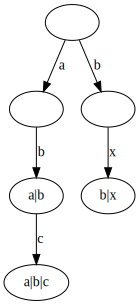
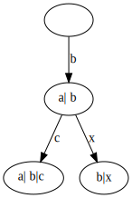

As I was shopping groceries I had a shocking realization: The active dependencies
of packages in a solver actually form a trie (a dependency `A|B` of a package `X`
is considered active if we marked `X` for install).

Consider the dependencies `A|B|C`, `A|B`, `B|X`. In Debian packages, or expresses a
preference relationship between its operands, so in `A|B|C`, `A` is preferred over `B`
and `B` over `C` (and `A` transitively over `C`).

This means that we can convert the three dependencies into a trie as follows:

Solving the dependency here becomes a matter of trying to install the package
referenced by the first edge of the root, and seeing if that sticks. In this
case, that would be 'a'. Let's assume that 'a' failed to install, the next
step is to remove the empty node of `a`, and merging its children into the
root.

For ease of visualisation, we remove "a" from the dependency nodes as well,
leading us to a trie of the dependencies "b", "b|c", and "b|x".

Presenting the Debian dependency problem, or the positive part of it as a
trie allows us for a great visualization of the problem but it may not proof
to be an effective implementation choice.

In the real world we may actually store this as a priority queue that we
can delete from. Since we don't actually want to delete from the queue
for real, our queue items are pairs of a pointer to dependency and an
activitity level, say `A|B@1`.
Whenever a variable is assigned false, we look at its reverse dependencies
and bump their activity, and reinsert them (the priority of the item being
determined by the leftmost solution still possible, it has now changed).
When we iterate the queue, we remove items with a lower activity level:

1. Our queue is `A|B@1`, `A|B|C@1`, `B|X@1`
1. Rejecting A bump the activity for its reverse dependencies and reinset them:
   Our queue is `A|B@1`, `A|B|C@1`, `(A|)B@2`, `(A|)B|C@2`, `B|X@1`
1. We visit `A|B@1` but see the activity of the underlying dependency is now 2 and remove it
   Our queue is `A|B|C@1`, `(A|)B@2`, `(A|)B|C@2`, `B|X@1`
1. We visit `A|B|C@1` but see the activity of the underlying dependency is now 2 and remove it
   Our queue is `(A|)B@2`, `(A|)B|C@2`, `B|X@1`
1. We visit `A|B@2`, see the activity matches and find B is the solution.
